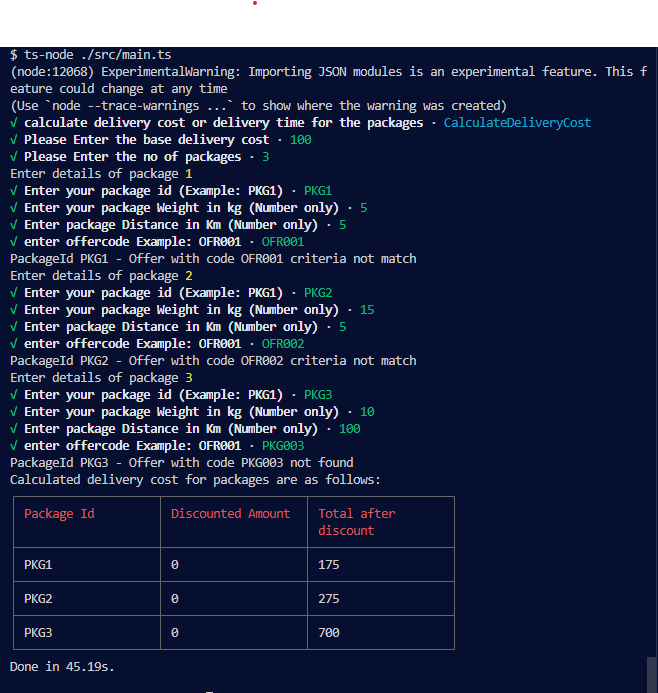
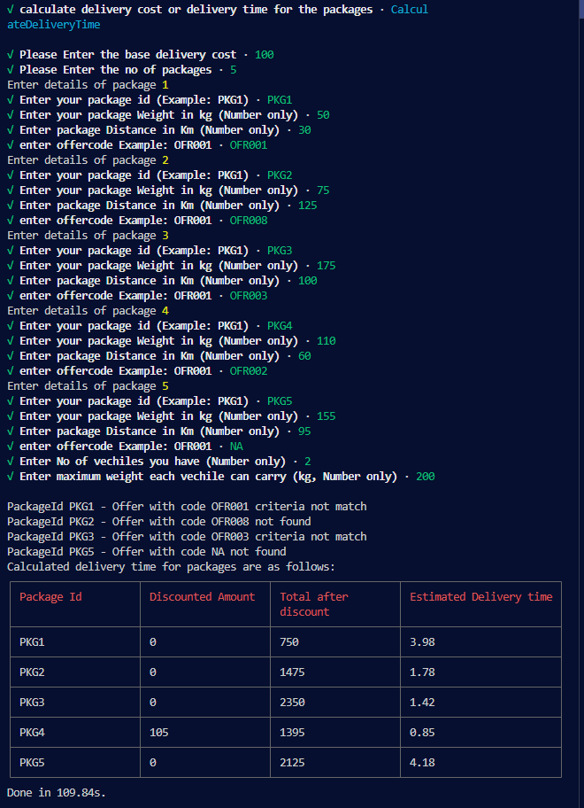

# Courrier service

# Table of contents

- [Courrier service](#courrier-service)
- [Table of contents](#table-of-contents)
- [Prerequisites](#prerequisites)
- [Run application](#run-application)
- [Run tests](#run-tests)
- [Results](#results)
- [Problem solving](#problem-solving)
- [Architecture](#architecture)
- [Known issues](#known-issues)
- [Package used](#package-used)

# Prerequisites

- Node.js version 16++
- Typescript version 4.5 ++

# Run application

    $ git clone https://github.com/kenchoong/courrier-service.git

    $ cd courrier-service

    $ yarn

    $ yarn start

    $ yarn dev (optional, for development)

Here will ask the question for which functionality you want to interact with

Note:

- yarn start: will build the js file, production mode, file in dist folder

- yarn dev: development mode, run by ts-node

# Run tests

    $ yarn test

    $ yarn test:coverage

Note:

- `yarn test:coverage`: will collect the coverage, but there are some minor issues (See the [known issues](#known-issues) section below)

# Results

For Problem 01, CLI keep asking question to collect input based on requirement

Insert the value below(1 by 1, from left to right)

```
100 3

PKG1 5 5 OFR001

PKG2 15 5 OFR002

PKG3 10 100 OFR003
```

To save your time, here is the outcome



For Problem 02, CLI keep asking question to collect input based on requirement

Insert the value below(1 by 1, from left to right)

```
100 5

PKG1 50 30 OFR001

PKG2 75 125 OFR008

PKG3 175 100 OFR003

PKG4 110 60 OFR002

PKG5 155 95 NA

2 70 200
```

To save your time, here is the outcome



Note: Result of PKG5 is 4.18, refer to [known issues](#known-issues) section below

# Problem solving

Problem are solved in different PR, added the comment inside the code for better explain the solution

**Problem 01**
[Feat/delivery cost](https://github.com/kenchoong/courrier-service/pull/1)

**Problem 02**
[Feat/delivery time](https://github.com/kenchoong/courrier-service/pull/3)

If you interested
[Analysis sketch of the problem 02(Github link)](./result/sketch.png)

# Architecture

This solution is build based on Domain Driven Design(DDD) and Clean Architecture.

Which contain 5 layers as below

```
src
├── api
│   ├── cli
│   │   ├── cli.ts
├── domain
├────├── │ entity
│    │   │ offer.ts      # The domain
│    │   | repository.ts # interface to interact with domain
├── infrastructure
│   ├── repository
|   |   | offer.ts # implement repository interface
├── lib
├── usecase
│   ├── delivery-cost # usecase for problem 01
│   ├──    ├── delivery-cost.controller.ts
│   ├──    ├── delivery-cost.service.ts
│   ├── delivery-time # usecase for problem 02
│   ├──    ├──  utils
│   ├──    ├──   ── assign-vehicle.ts # etc
│   ├──    ├── delivery-time.controller.ts
│   ├──    ├── delivery-time.service.ts
│   ├── inquire
│   ├── offer
│   ├──   .... etc # other usecase
├── main.ts
```

**Usage of each folder**

- **api**: the entry point of the app

  For now it only contain CLI, in future can extend to graphql, rest api, etc

- **domain**: the core of the app

  The domain is the offer, it is the entity that we are going to interact with

- **infrastructure**: the implementation of the domain

  The place that interact to all different database we need, or other technology infrastructure here

- **lib**:
  Contain the helper class to interact with external library

- **use-case**: the business logic of each functionality

  The use-case is the delivery-cost and delivery-time

- **utils** in use-case:

  Separate critical function to make the code more readable and maintainable

In this app, didnt use any database, the `offer` in Problem 1 just store in JSON file, all our code is interacting with the JSON file.

**File naming convention**

`.controller.ts`: the entry point of the usecase

`.service.ts`: the business logic of the usecase

`.spec.ts`: the test of each file or function

`.dto.ts`: the data transfer object

# Known issues

- [When run `yarn test:coverage` all test cases failed](https://github.com/kenchoong/courrier-service/issues/7)
- [ PKG5 result is 4.18, instead of 4.19](https://github.com/kenchoong/courrier-service/issues/6)

# Package used

- [Enquirer](https://www.npmjs.com/package/enquirer) - CLI prompt
- [Inversify](https://inversify.io/) - Dependency injection
- [Jest](https://jestjs.io/) - Testing
- [jest-mock-extended](https://www.npmjs.com/package/jest-mock-extended) - Mocking
- [class-transformer](https://www.npmjs.com/package/class-transformer) - Transform data
- [cli-table3](https://www.npmjs.com/package/cli-table3) - CLI table

Fun fact: Except jest, all first time usage for me. I hope I can learn something new in every project.

That's it. Have a nice day.
