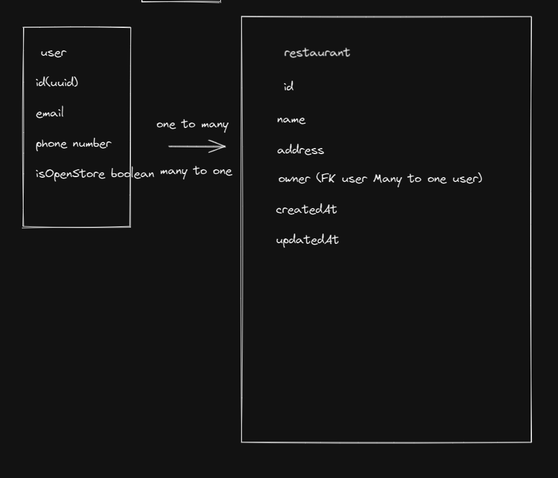
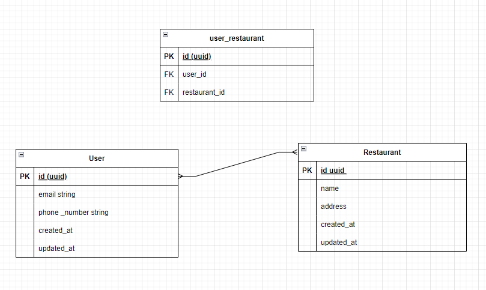
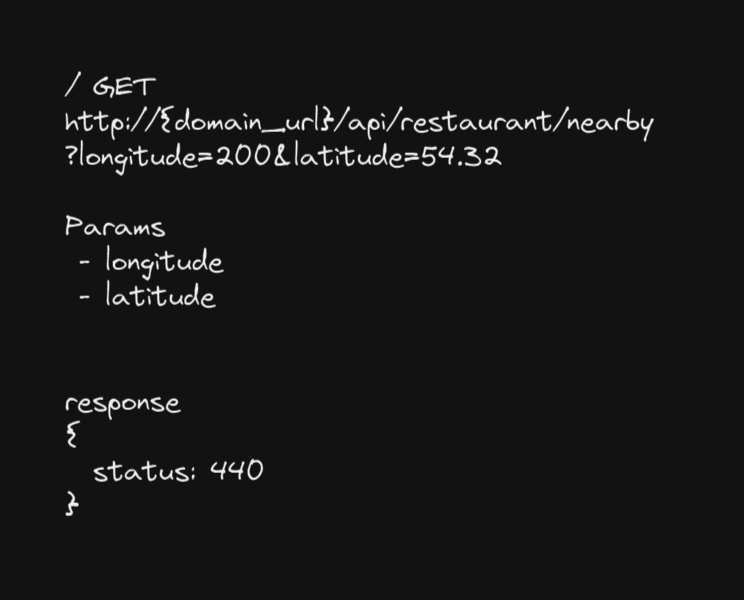

# Follow up answer for interview question

## 1. How to differentiate which restaurant to which user?

During the interview, this is being asked:

Given User table and Restaurant table, how to differentiate which restaurant to which user?

Original answer:



This is my original answer which is

1. `User` table One-to-Many relationship with `Restaurant` table
2. Then in `User` table add a column named `isOpenStore`
3. This `isOpenStore` is a boolean value, if it is `true`, then it is a restaurant owner, if it is `false`, then it is a customer.

I have some thought about this, which is I believe is not effecient enough. Because this is like mixed up the data of two different tables and store in 1 table(User table)

Ok, if given me the second chance, I will answer like this:



1. `User` table should have Many-to-Many relationship with `Restaurant` table, and will have a new table auto created named `UserRestaurant` to store the relationship between `User` and `Restaurant` table.

   In layman terms which is:

   - 1 user can have multiple restaurants
   - At the same time, 1 restaurants can own by multiple users

2. Design an API url to get all the restaurant nearby a user longitude and latitude point.

My original answer is this, which is wrong:


What is wrong is:

1. In this API url, I only know the position of the user, but I don't know how much radius I should search for.
2. During the interview, I used POST request. Which is wrong, because I didnt create anything in this request.
3. Status code is 440. Which is wrong, because I am like make this up during the interview, because my brain cant function properly.

Therefore if given me the second chance, here will be my answer:

```ts

GET /api/restaurants/nearby?lat=1.234&lng=2.345&radius=1000

// Params
lat: latitude of the user
lng: longitude of the user
radius: radius of the search, km unit

// Response
{
  "status": 200,
  "data": [
    {
      "id": 1,
      "name": "Restaurant 1",
      "lat": 4.568, // some other number value
      "lng": -12.35,
    },
    {
      "id": 2,
      "name": "Restaurant 2",
      "lat": 9.58, // some other number value
      "lng": -100.87,
    }
  ]
}
```

Then in `Restaurant` table should add 2 column named `latitude` and `longitude` to store the latitude and longitude of the restaurant.

Both field should be `float` type.

Why using `nearby` in URL?

Because I want to make a new resource, which will more clear to represent that this API is to get the restaurant nearby a user.

That's it, just some follow up answer for the question asked during the interview, will I think I able to answer, just miss up during the interview.

But of course, still a lot I dont know, I will keep research more in location domain.